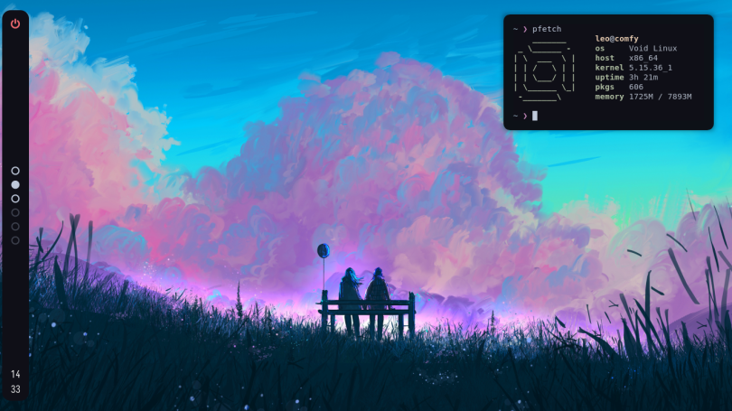
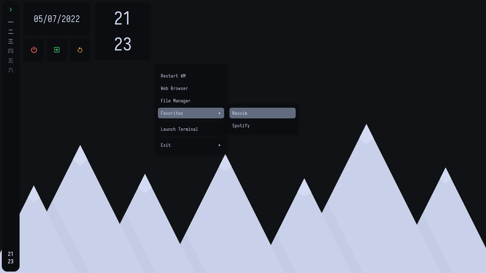
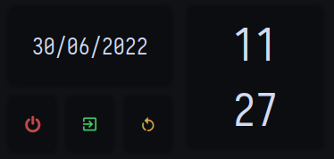
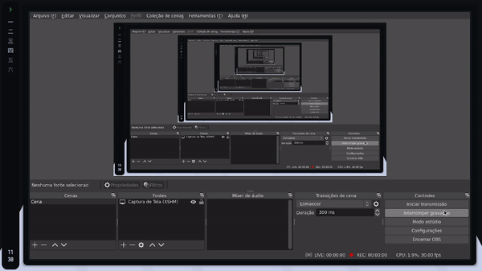

<h1 align="center">
    
</h1>

## welcome! 

hello, thanks for visiting :heart:! if you like this [rice](https://thatnixguy.github.io/posts/ricing/) or even use, please, can you drop a star? i love it!

## about




- OS [Void](https://voidlinux.org) simple, light and amazing 👽
- WM [bspwm](https://github.com/baskerville/bspwm) simple and good window manager 🪟
- bar and widgets [eww](https://github.com/elkowar/eww) beautiful and amazing ☘️ 
- aplication launcher [rofi](https://github.com/davatorium/rofi) fast! :rocket:
- terminal [alacritty](https://github.com/alacritty/alacritty/) fast and simple🍁 
- shell [hilbish](https://github.com/rosettea/hilbish) the flower shell 🌺
- theme [ok-theme](https://github.com/itsook/ok-theme) dark and beautiful 🌌 
- editor [neovim](https://github.com/neovim) fast, simple and amazing! 👾
- menu [jgmenu](https://jgmenu.github.io/) fast, cool and simple to configure! ✨

## installation 

#### 1. installing bspwm

on void:

```sh-session
$ xbps-install bspwm
```

on arch linux:

```sh-session
$ yay -S bspwm
```

(you can use another aur helper)

on ubuntu or debian:

```sh-session
$ apt install bspwm
```

on fedora:

```sh-session
$ dnf install bspwm
```

#### 2. installing eww 

OBS: if you are a void user, you can use the [eww-template](https://github.com/monke0192/eww-template)

for first, install `cargo` 🦀:

```sh-session
$ curl https://sh.rustup.rs -sSf | sh
```

it will download a script, and start the installation. if everything goes well, you’ll see this appear: `Rust is installed now. Great!`

clone and cd into eww folder:

```sh-session
$ git clone https://github.com/elkowar/eww.git && cd eww
```

now compile the eww binary: 

```sh-session
$ cargo build --release -j $(nproc)
```

now move the binary to `/usr/bin` and give permissions:

```sh-session
$ sudo mv target/release/eww /usr/bin/ && sudo chmod +x /usr/bin/eww
```

and finally done the installation of eww! 🌌 

#### 3. installing the packages

on arch linux:

```sh-session
$ yay -S alacritty sxhkd hilbish rofi ninja gcc meson go jgmenu
```

on void:

```sh-session
$ xbps-install -S alacritty sxhkd rofi ninja gcc meson go jgmenu
```

on void, fedora and ubuntu you need to compile hilbish manually: 

```sh-session
$ git clone --recursive https://github.com/Rosettea/Hilbish
$ cd Hilbish
$ go get -d ./...
$ make dev
$ sudo make install
```

on fedora: 

```sh-session
$ dnf install sxhkd alacritty rofi ninja gcc meson go jgmenu
```

on ubuntu:

```sh-session
$ apt install sxhkd rofi ninja gcc meson go jgmenu
```

to install alacritty in ubuntu you need run this:

```sh-session
$ sudo add-apt-repository ppa:aslatter/ppa
$ sudo apt update
$ sudo apt install alacritty
```

#### 4. installing picom fork

on arch linux: 

```sh-session
$ yay -S picom-arian8j2-git
```

ìf you use another os, you will need these packages:

* libx11
* libx11-xcb
* libXext
* xproto
* xcb
* xcb-damage
* xcb-xfixes
* xcb-shape
* xcb-renderutil
* xcb-render
* xcb-randr
* xcb-composite
* xcb-image
* xcb-present
* xcb-xinerama
* xcb-glx
* pixman
* libdbus (optional, disable with the `-Ddbus=false` meson configure flag)
* libconfig (optional, disable with the `-Dconfig_file=false` meson configure flag)
* libGL (optional, disable with the `-Dopengl=false` meson configure flag)
* libpcre (optional, disable with the `-Dregex=false` meson configure flag)
* libev
* uthash

after install the packages, run it:

```sh-session
$ git submodule update --init --recursive
$ meson --buildtype=release . build
$ ninja -C build
$ ninja -C build install
```

and done, picom fork installed!

#### so now, finally install the dots

```sh-session
$ git clone https://github.com/justleoo/dotfiles/ && cd dotfiles
$ mv conf/ ~/.config/
$ chmod +x ~/.config/bspwm/*
$ chmod +x ~/.config/eww/bar/scripts/*
```

have a good time enjoying and ricing! :heart:

## gallery 

a simple bar!


eww widgets 



picom animations



## credits

[Syndrizzle](https://github.com/Syndrizzle/hotfiles) for readme inspiration

[saimoomedits](https://github.com/saimoomedits/dotfiles) for help me a lot with all!

[AlphaTechnolog](https://github.com/alphatechnolog) for help me with picom and more

[janleigh](https://github.com/janleigh) for jgmenu config!

and you! of course.

## license

MIT License. see [LICENSE](https://github.com/justleoo/dotfiles/blob/main/LICENSE) file.
