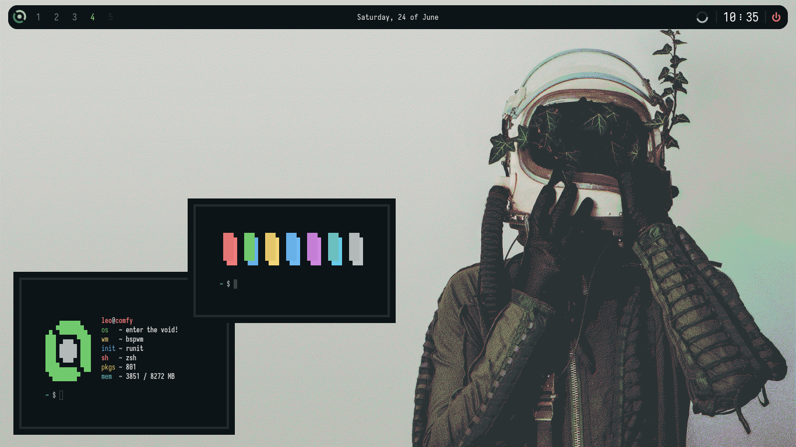
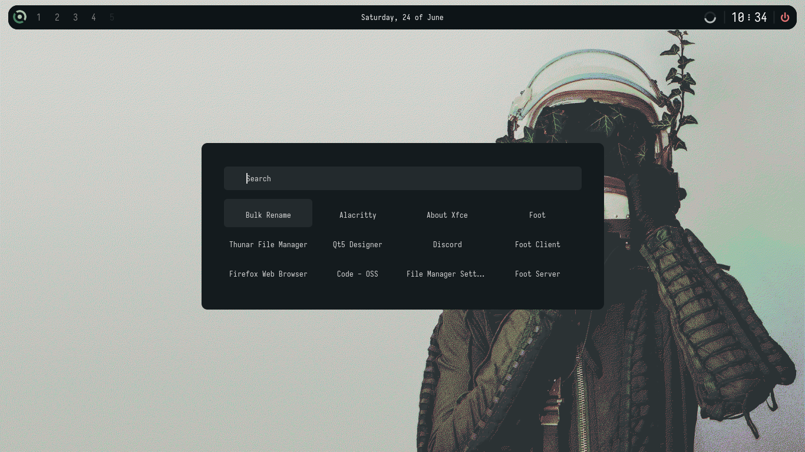

<h1 align="center">
    
</h1>

## welcome!

hey, thanks for visiting :heart:! if you like this [rice](https://thatnixguy.github.io/posts/ricing/) or even use it, can you drop a star please? i really appreciate it!

## about:




- OS: [Void Linux](https://voidlinux.org) 🛸
- Window Manager: [bspwm](https://github.com/baskerville/bspwm) 🪟
- bar: [eww](https://github.com/elkowar/eww) 🍄
- application launcher: [rofi](https://github.com/davatorium/rofi) 🚀
- terminal: [alacritty](https://github.com/alacritty/alacritty/) ✨
- theme: [everblush](https://github.com/everblush/) 🦋
- menu: [jgmenu](https://jgmenu.github.io/) 🌌

## installation:

#### 1. installing bspwm

on void:

```sh-session
$ xbps-install bspwm
```

on arch linux:

```sh-session
$ yay -S bspwm
```
(you can use another aur helper)

on gentoo:

```sh-session
$ emerge bspwm
```

on ubuntu or debian:

```sh-session
$ apt install bspwm
```

on fedora:

```sh-session
$ dnf install bspwm
```

#### 2. installing eww 

OBS: if you are a void user, you can use the [eww-template](https://github.com/monke0192/eww-template)

for first, install `cargo` 🦀:

```sh-session
$ curl https://sh.rustup.rs -sSf | sh
```

it will download a script, and start the installation. if everything goes well, you’ll see this appear: `Rust is installed now. Great!`

clone and cd into eww folder:

```sh-session
$ git clone https://github.com/elkowar/eww.git && cd eww
```

now compile the eww binary: 

```sh-session
$ cargo build --release -j $(nproc)
```

now move the binary to `/usr/bin` and give permissions:

```sh-session
$ sudo mv target/release/eww /usr/bin/ && sudo chmod +x /usr/bin/eww
```

and finally done the installation of eww! 🌌 

#### 3. installing the packages

on arch linux:

```sh-session
$ yay -S alacritty sxhkd rofi ninja picom jgmenu
```

on gentoo:

```sh-session
$ emerge alacritty sxhkd rofi picom
```
installing jgmenu on gentoo:

```sh-session
$ git clone https://github.com/johanmalm/jgmenu.git
$ cd jgmenu
$ ./configure
$ make
$ sudo make install
```

on void:

```sh-session
$ xbps-install -S alacritty sxhkd rofi picom jgmenu
```

on fedora: 

```sh-session
$ dnf install sxhkd alacritty rofi picom jgmenu
```

on ubuntu:

```sh-session
$ apt install sxhkd rofi picom jgmenu
```

to install alacritty in ubuntu you need run this:

```sh-session
$ sudo add-apt-repository ppa:aslatter/ppa
$ sudo apt update
$ sudo apt install alacritty
```

#### finally install the dots!

```sh-session
$ git clone https://github.com/justleoo/dotfiles/ && cd dotfiles
$ git checkout bspwm-everblush
$ mv conf/bspwm ~/.config/
$ mv conf/eww ~/.config/
$ mv conf/jgmenu ~/.config/
$ mv conf/alacritty ~/.config/
$ mv conf/picom ~/.config/
$ mv conf/sxhkd ~/.config/
$ chmod +x ~/.config/bspwm/*
$ chmod +x ~/.config/eww/bar/scripts/*
```

have a good time ricing! :heart:

## gallery 📷

#### simple horizontal bar


#### a menu with useful functions


#### custom rofi 


## credits:

[AlphaTechnolog](https://github.com/alphatechnolog) for help me a lot!! <3

[saimoomedits](https://github.com/saimoomedits/dotfiles) for help me with eww bar

[janleigh](https://github.com/janleigh) for the borders script and more

##### and thank you too! i hope you liked it.

## LICENSE

MIT License. see [LICENSE](https://github.com/justleoo/dotfiles/blob/bspwm-everblush/LICENSE) file.
