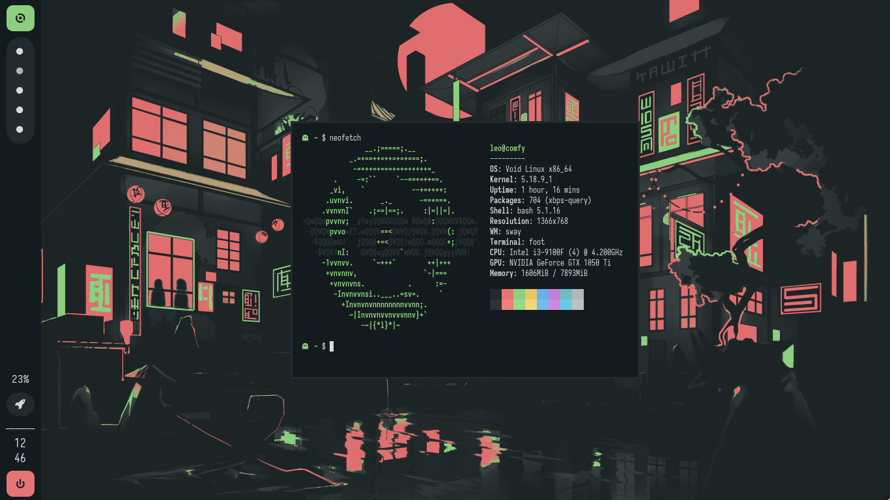

<div align="center">
  <h1>:hibiscus: leoo's dotfiles</h1>
</div>

## welcome!

hello, thanks for visiting :heart:! if you like this [rice](https://thatnixguy.github.io/posts/ricing/) or even use, please, can you drop a star? i love it! you're now in `sway` branch, but you can see another rice on [bspwm](https://github.com/justleoo/dotfiles/tree/bspwm) branch!

## about



- OS [Void](https://voidlinux.org) simple, light and amazing 👽
- WM [sway](https://swaywm.org/) fast, simple and cool! 🍷
- bar [waybar](https://github.com/Alexays/Waybar) simple to configure 🌌
- terminal [foot](https://codeberg.org/dnkl/foot) fast 🐾
- theme [everblush](https://github.com/everblush) beautiful! ✨

## installation

install packages:

on arch:

```sh-session
$ paru -S sway waybar foot wofi
```

on void:

```sh-session
$ xbps-install -S sway Waybar foot wofi
```

on fedora

```sh-session
$ dnf install sway waybar foot wofi
```

## clone the files

```sh-session
$ git clone https://github.com/justleoo/dotfiles/ && cd dotfiles/
```

## move the files to your `~/.config/`

```sh-session
$ mv conf/foot/ ~/.config/
$ mv conf/waybar/ ~/.config/
$ mv conf/sway/ ~/.config/
```

## running sway

so, finally! how run sway? try to just run in your tty `sway`, or `WLR_NO_HARDWARE_CURSORS=1 sway`.

## keys 🔑

| key | action |
|------|-------|
|<kbd>super + enter</kbd>| open foot|
|<kbd>super + r</kbd>| open wofi|
|<kbd>super + e</kbd>|enter resize mode (use the right, left, up and down arrow keys to use this mode working)|
|<kbd>super + [1-0]</kbd>|go to workspaces|
|<kbd>super + q</kbd>|close a window|

## thanks

[siduck](https://github.com/siduck)

[AlphaTechnolog](https://github.com/alphatechnolog) 

## license

see [LICENSE](https://github.com/justleoo/dotfiles/blob/sway/LICENSE) file.
