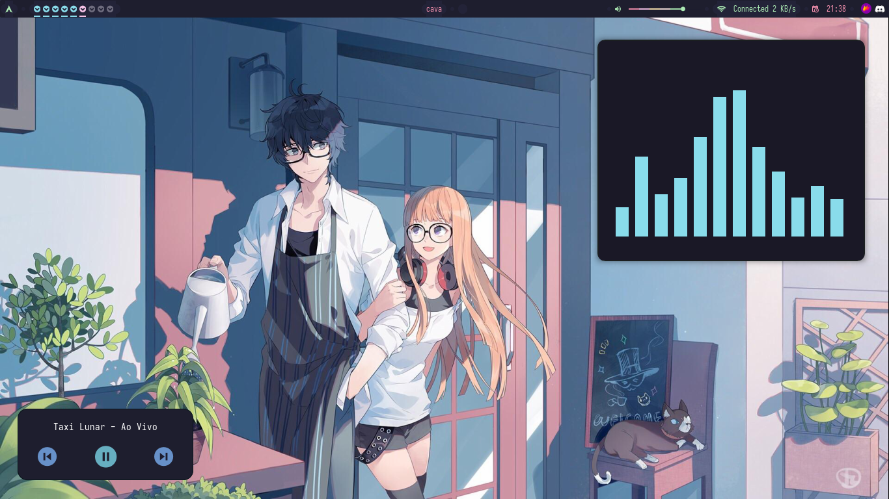
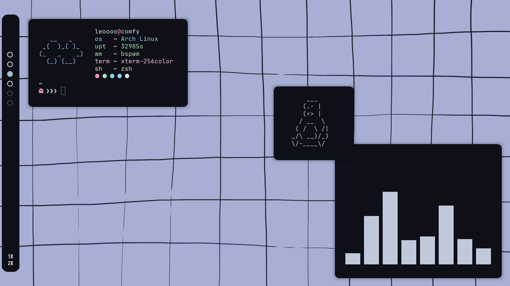
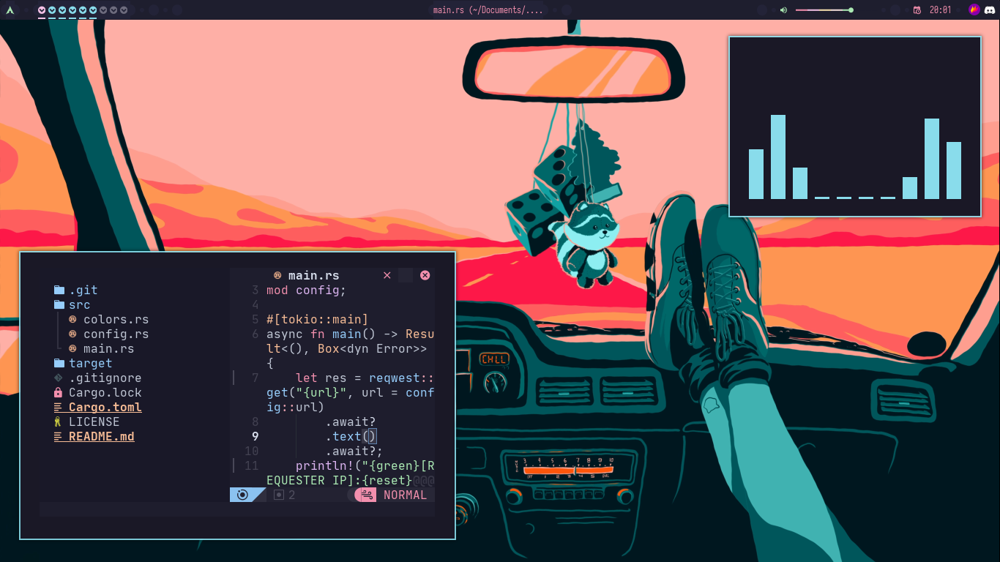

welcome to my dotfiles, have a good time enjoying and ricing! 🌺

## info and requirements

- WM: bspwm
- notification system: dunst
- shell: zsh
- OS: arch linux
- keybinding handler: sxhkd
- editor: neovim (with nvchad)
- bar: polybar
- terminal: tym and kitty
- app launcher: rofi
- audio visualizer: cava
- compositor: picom
- fetches: [skyfetch](https://github.com/justleoo/skyfetch), neofetch, pfetch

## shell 🐚

i use [oh my zsh](https://ohmyz.sh), with common theme, view config in `~/home/.zshrc`

## showcase 

## notes

if you like this config, give a star? 

## license 📜

MIT license, see license file.

## thanks 💙

[pagankeymaster](https://github.com/pagankeymaster) for help me with tym config

[catppuccin](https://github.com/catppuccin) for made a awesome theme 😼

[bleyom](https://github.com/bleyom) by picom config with some modifications of mine
