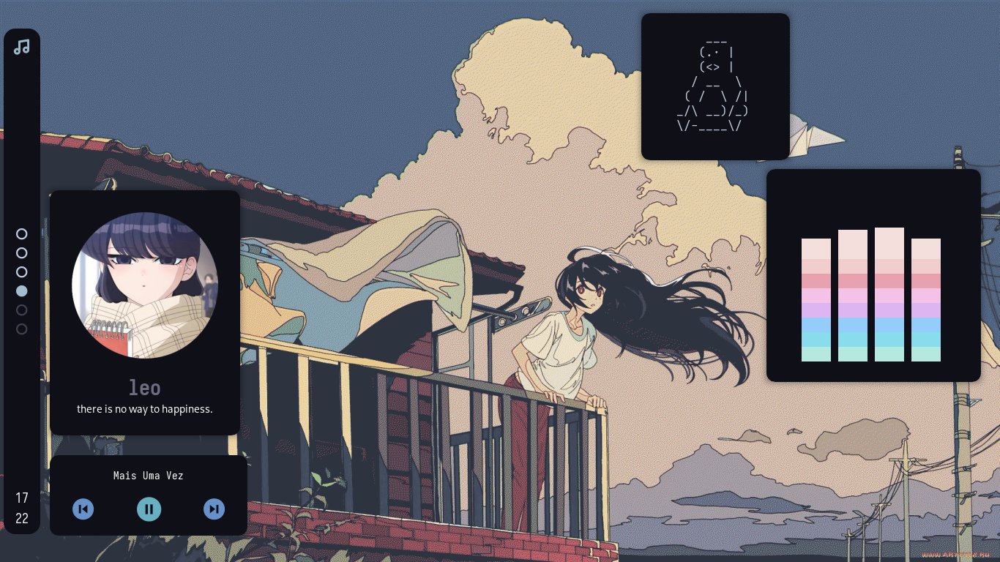

[](https://git.io/typing-svg)

welcome to my dotfiles, have a good time enjoying and ricing! 🌺

<hr>

## info and requirements

- WM: [bspwm](https://github.com/baskerville/bspwm)
- notification system: [dunst](https://github.com/dunst-project/dunst)
- shell: [zsh](https://ohmyz.sh)
- GTK theme: [levuaska](https://github.com/saimoomedits/levuaska/tree/main/.themes/levuaska)
- OS: [arch](https://archlinux.org)
- keybinding handler: [sxhkd](https://github.com/baskerville/sxhkd)
- bar and widgets: [eww](https://github.com/elkowar/eww)
- terminal: [tym](https://github.com/endaaman/tym)
- app launcher: [rofi](https://github.com/davatorium/rofi)
- compositor: [picom](https://github.com/yshui/picom)
- fetches: [skyfetch](https://github.com/justleoo/skyfetch), [bunnyfetch](https://github.com/elenapan/dotfiles/blob/master/bin/bunnyfetch)

## eww notes

i made a script to open and close eww widgets with my friend, see this in `~/.scripts/dash`, options of script:

  | option      | what this do? |
  | ----------- | ----------- |
  | `dash open` | open all eww widgets |
  | `dash close` | close all eww widgets |
  | `dash toggle`   | if the widgets are not open, this open the widgets, and if you execute again, close the widgets. |

## basic keys

  | key | what this do? |
  | ----------- | ----------- |
  | `super + enter` | open terminal (i use tym, but you can change it) |
  | `super + r` | open rofi (app launcher) |
  | `super + f` | open firefox (browser) |
  | `super + p` | open flameshot |
  | `super + m` | open spotify |
  | `super + c` | restart bspwm |
  | `super + alt + q` | quit bspwm |
  | `super + q` | close and kill a window |

## installation (arch and arch based)

1. clone the repository

```
git clone https://github.com/justleoo/dotfiles
cd dotfiles
```

2. install the packages

```
yay -S sxhkd bspwm feh zsh picom tym dunst spotify firefox nerd-fonts-complete
```

3. move the files 

```
cp .local/bin/* ~/.local/bin/
mkdir .scripts/
cp .scripts/* ~/.scripts/ 
chmod +x ./$HOME/.scripts/*
cp -r ./.config/* ~/.config/
chmod +x ~/.config/bspwm/bspwmrc
chmod +x ~/.config/eww/
```

~~i don't know exactly if this works, but it's supposed to work~~


## showcase 



## thank you!

just visiting my dotfiles makes me happy! but if you like the config or use it, you can give it a star! this can help me keep making rices, but if you don't want to, no problem c:

## license 📜

MIT license, see license file.

## thanks and credits 💙

[saimoomedits](https://github.com/saimoomedits) for help me a lot with all! <3
[elenapan](https://github.com/elenapan) for made the bunnyfetch!
[AlphaTechnolog](https://github.com/AlphaTechnolog) for help me with eww scripts!
[torvalds](https://github.com/torvalds) for add [uwu](https://github.com/justleoo/dotfiles/blob/main/uwu) file uwu
